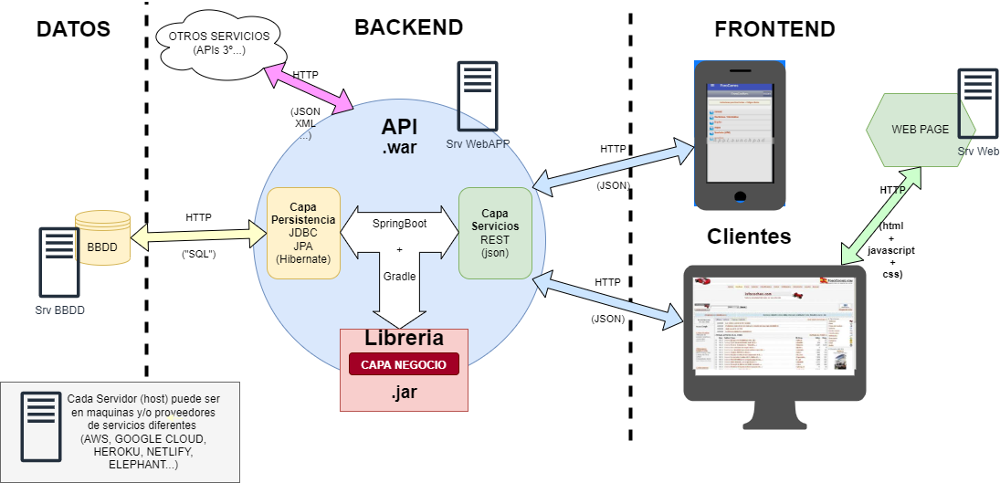
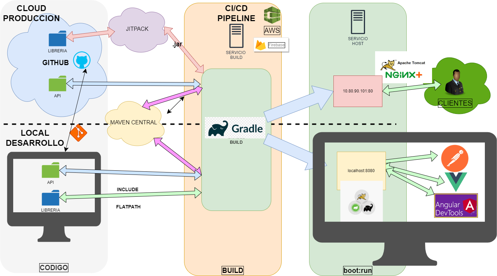

# Trabajando con librerías en local

---

### INDICE

- [Trabajando con librerías en local](#trabajando-con-librerías-en-local)
    - [INDICE](#indice)
  - [Proyecto API-Libreria](#proyecto-api-libreria)
  - [Integrando Librerias](#integrando-librerias)
    - [Integrar Proyecto Local](#integrar-proyecto-local)
    - [Incluir libreria de repo publico (GitHub)](#incluir-libreria-de-repo-publico-github)
    - [Incluir libreria de repo publico (GitHub)](#incluir-libreria-de-repo-publico-github-1)
    - [Incluir libreria de repo publico (GitHub) II](#incluir-libreria-de-repo-publico-github-ii)

---

## Proyecto API-Libreria

**Propósito:**
Generar un proyecto-API con SpringBoot Con la capa de servicios

Generar Un proyecto-LIB con Springboot Con la capa de negocio

Utilizar ambos

---

## Integrando Librerias

Voy a utilizar código de otro proyecto en el mio. Podré desarrollar por un lado el proyecto-**API** para realizar la persistencia y la capa REST y en otro proyecto-**LIB** (mi libreria) desarrollaré la lógica de mi negocio (java "puro")

Ambos proyectos deberían ser Proyectos Gradle:

- El de la API con Spring con todas las dependencias para REST y persistencia
- El de la LIB sera un proyecto Gradle Spring, sin dependencias (aunque se le quitarán las anotaciones Spring).

---




Notas:
https://es.wikipedia.org/wiki/Modelo%E2%80%93vista%E2%80%93controlador
https://www.freecodecamp.org/espanol/news/el-modelo-de-arquitectura-view-controller-pattern/


---

### Integrar Proyecto Local

Prerrequisitos:

- Está generado el proyecto API y la libreria con Spring.
- Están en local (clonados o generados).
- Ambos Proyectos deberian tener su propio **GIT**

>Nota:
>Las versiones de Spring  3+ generan por defecto proyectos con java 17+

>**JITPACK** compila por defecto solo con java 1.8 --> usar SpringBoot 2.7+ y java 1.8 (al menos en la libreria)

---

1. El `proyecto-LIBreria` esta en la misma carpeta donde está mi `proyecto-API` _(en carpetas hermanas)_
2. Al proyecto **LIB**reria le quito todas las anotaciones e importaciones de Spring
   - Del main
     - @SpringApplication
     - SpringContext = `SpringApplication.run`
   - Del build.gradle
     - dependencias y plugins Spring  _`...Springframework...`_
   - La carpeta de Tests _(Los test se ejecutaran desde la API)_
3. Importar ambos proyectos Gradle en eclipse.
   - Usar valores por defecto
4. En el `build.gradle` del proyecto **LIB**
   - Eclipse Necesita ademas los plugin
```
     `id 'java'`
     `id 'java-library'`
     `id 'eclipse'`
```

---

5. En el **`settings.gradle`** del proyecto **API**
   - Debe coincidir el nombre del directorio con el del proyecto
```
`rootProject.name = 'nombreProyectoAPI'` 
//(si esta hecho con Spring lo genera automáticamente)
```
   - Introduzco una linea nueva con:
```
includeFlat 'proyecto-LIBreria'
```
> Debe ser el mismo nombre que tiene el proyectoLIB en su settings.gradle

---

6. En el **`build.gradle`** del proyecto **API**
   - Introduzco en el apartado **`dependencias`**
```
dependencies {
  //
  implementation project(':proyecto-LIBreria')
}
```
7. Ejecutar **Refresh gradle project**
> En propiedades de mi proyecto en java build path (o en la carpeta Project and External Dependencies) 
> 
> **→ saldrá la librería como una dependencia**

8. _Comprobar llamando desde la API a un metodo de una clase de la libreria_

---

### Incluir libreria de repo publico (GitHub)

Pretendo usar una libreria de un repositorio publico de GitHub (Sin compilar) para lo que se necesita compilar con jit-pack.

Notas:
Documentacion: [JitPack](https://docs.jitpack.io/building/)

---





---

### Incluir libreria de repo publico (GitHub)
En La **API** 

1. Necesita el **plugin**

```
id 'application'
```
2. Añado el repositorio **JitPack**

```
repositories {
      mavenCentral()
      maven { url 'https://jitpack.io' }
}
```

---

### Incluir libreria de repo publico (GitHub) II
En la **LIB**reria
1.  La libreria debe estar publicada en GitHub en un repo publico
    - puedo usar _**nºcommit, version o snapshot**_
2.  Necesita el plugin
```
id 'java-library'
```
3. Debe haber una release de la libreria

> Jitpack [funciona por defecto con java 8](https://docs.jitpack.io/building/#java-version)

---

5. Incluir la libreria en la API --> Ir a dependencias y añadir linea 
```
implementation 'Grupo:artefacto:Versión'
// implementation 'com.github.usuarioPepe:repoLibreria:Tag'
```
1. Ejecutar _`gradle → refresh project`_
> --> Saldrán en project and external dependencies las que haya añadido, pudiendo emplearlas en mi codigo


Notas:

- grupo: es la ruta al usuario de GitHub 
- artefacto: es el proyecto del usuario 
- versión: es el tag-release 

> En la version se puede poner 
> - 1 version concreta (debe existir un tag)
> - sanapshot (ultima versión) 
> - 1 commit concreto > puedo poner varias versiones que se crearan en sus carpetas correspondientes

