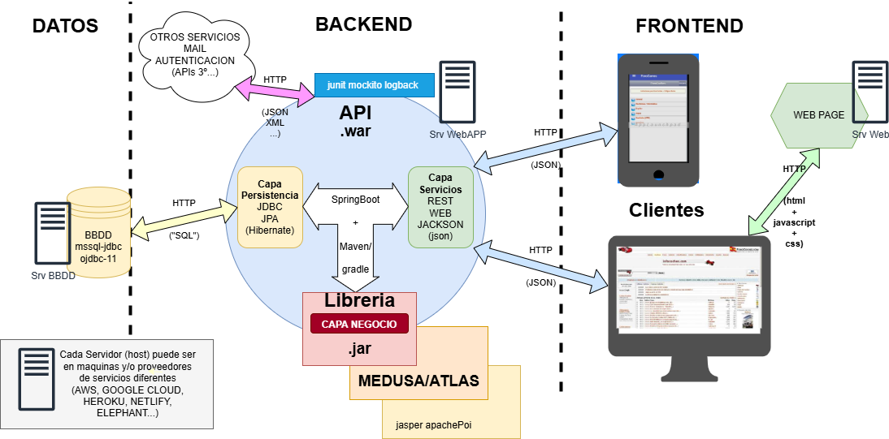
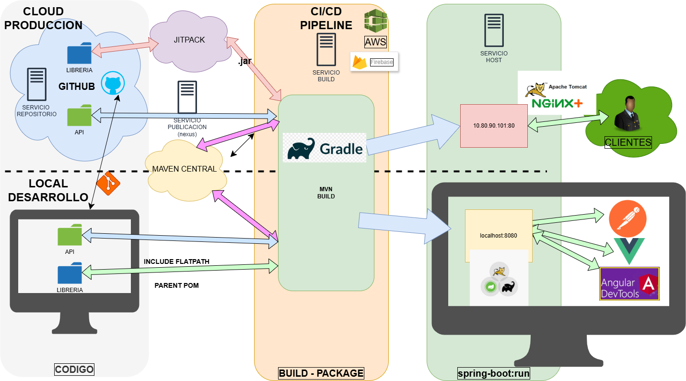

# Trabajando con librerías en local

<a href="..\..\README.md">indice de Presentaciones</a>

---

### INDICE

- [Trabajando con librerías en local](#trabajando-con-librerías-en-local)
    - [INDICE](#indice)
  - [Proyecto API-Libreria](#proyecto-api-libreria)
  - [Integrando Librerias](#integrando-librerias)
    - [Integrar Proyecto Local](#integrar-proyecto-local)
    - [Incluir libreria de repo publico (GitHub)](#incluir-libreria-de-repo-publico-github)
    - [Incluir libreria de repo publico (GitHub)](#incluir-libreria-de-repo-publico-github-1)
    - [Incluir libreria de repo publico (GitHub) II](#incluir-libreria-de-repo-publico-github-ii)
    - [Publicar en GitHub Packages (Maven)](#publicar-en-github-packages-maven)
- [Fin de la presentacion](#fin-de-la-presentacion)

---

## Proyecto API-Libreria

**Propósito:**
Generar un proyecto-API con SpringBoot Con la capa de servicios

Generar Un proyecto-LIB con Springboot Con la capa de negocio

Utilizar ambos

---

## Integrando Librerias

Voy a utilizar código de otro proyecto en el mio. Podré desarrollar por un lado el proyecto-**API** para realizar la persistencia y la capa REST y en otro proyecto-**LIB** (mi libreria) desarrollaré la lógica de mi negocio (java "puro")

Ambos proyectos deberían ser proyectos **Maven**:

- El de la **API**: proyecto Spring Boot (Maven) con dependencias para REST y persistencia.
- El de la **LIB**: proyecto Maven tipo librería (`packaging` = `jar`) sin dependencias Spring (se le quitarán las anotaciones Spring del código).

---




Notas:
https://es.wikipedia.org/wiki/Modelo%E2%80%93vista%E2%80%93controlador
https://www.freecodecamp.org/espanol/news/el-modelo-de-arquitectura-view-controller-pattern/


---

### Integrar Proyecto Local

Prerrequisitos:

- Está generado el proyecto API y la libreria con Spring.
- Están en local (clonados o generados).
- Ambos Proyectos deberian tener su propio **GIT**

>Nota:
>Las versiones de Spring  3+ generan por defecto proyectos con java 17+

>**JITPACK** compila por defecto solo con java 1.8 --> usar SpringBoot 2.7+ y java 1.8 (al menos en la libreria)

---

1. El `proyecto-LIBreria` esta en la misma carpeta donde está mi `proyecto-API` _(en carpetas hermanas)_
2. Al proyecto **LIB**reria le quito todas las anotaciones e importaciones de Spring
   - Del main
     - @SpringApplication
     - SpringContext = `SpringApplication.run`
   - Del `pom.xml`
     - eliminar dependencias `spring-boot-starter-*` y el plugin `spring-boot-maven-plugin` (si existen) para dejarlo como biblioteca Java pura
   - La carpeta de Tests _(Los test se ejecutarán desde la API o desde un módulo dedicado)_
3. Importar ambos proyectos **Maven** en Eclipse.
   - File → Import... → **Maven** → **Existing Maven Projects** → seleccionar la carpeta del proyecto → Finish (asegúrese de tener instalado M2E).
4. En el `pom.xml` del proyecto **LIB**
   - Asegúrese de que `packaging` sea `jar` y configure el `maven-compiler-plugin` (source/target). Ejemplo:
```
<packaging>jar</packaging>

<build>
  <plugins>
    <plugin>
      <artifactId>maven-compiler-plugin</artifactId>
      <version>3.10.1</version>
      <configuration>
        <source>17</source>
        <target>17</target>
      </configuration>
    </plugin>
  </plugins>
</build>
```

---

5. (Multi-módulo recomendado) Crear un *parent* `pom.xml` que agrupe ambos proyectos (ubicado en la carpeta padre):

Ejemplo de `pom.xml` (parent):
```
<project xmlns="http://maven.apache.org/POM/4.0.0" xmlns:xsi="http://www.w3.org/2001/XMLSchema-instance"
         xsi:schemaLocation="http://maven.apache.org/POM/4.0.0 http://maven.apache.org/xsd/maven-4.0.0.xsd">
  <modelVersion>4.0.0</modelVersion>
  <groupId>com.miempresa</groupId>
  <artifactId>workspace-parent</artifactId>
  <version>0.0.1-SNAPSHOT</version>
  <packaging>pom</packaging>
  <modules>
    <module>proyecto-LIBreria</module>
    <module>proyecto-API</module>
  </modules>
</project>
```
> Asegúrese de que los nombres de carpeta coincidan con los nombres de módulo.

Alternativa: si los proyectos son independientes, ejecute `mvn install` en la librería para instalarla en el repositorio local y luego añada la dependencia en la API.

---

6. En el `pom.xml` del proyecto **API** añada la dependencia a la librería:
```
<dependency>
  <groupId>com.miempresa</groupId>
  <artifactId>proyecto-LIBreria</artifactId>
  <version>0.0.1-SNAPSHOT</version>
</dependency>
```
- Si usa un `parent` multi-módulo, el reactor de Maven compilará y resolverá el módulo LIB automáticamente; si no, ejecute `cd proyecto-LIBreria && mvn install` antes de compilar la API.
7. Actualizar dependencias y compilar
- En Eclipse: botón derecho sobre el proyecto → **Maven** → **Update Project...**
- Desde la consola (multi-módulo): `mvn -am -pl proyecto-API package` o `mvn -am -pl proyecto-API spring-boot:run`
> En Eclipse aparecerá la librería en `Maven Dependencies` y podrá usarse desde la API.

8. _Comprobar llamando desde la API a un metodo de una clase de la libreria_

---

### Incluir libreria de repo publico (GitHub)

Pretendo usar una libreria de un repositorio publico de GitHub (Sin compilar) para lo que se necesita compilar con jit-pack.

Notas:
Documentacion: [JitPack](https://docs.jitpack.io/building/)

---





---

### Incluir libreria de repo publico (GitHub)
En la **API** (Maven)

1. Añadir el repositorio **JitPack** en el `pom.xml`:
```
<repositories>
  <repository>
    <id>jitpack.io</id>
    <url>https://jitpack.io</url>
  </repository>
</repositories>
```

2. Añadir la dependencia en `pom.xml` con las coordenadas `com.github.usuario:repo:version`.

Ejemplos Maven (JitPack):

- Dependencia por **release tag** (recomendado para producción):
```
<dependency>
  <groupId>com.github.User</groupId>
  <artifactId>Repo</artifactId>
  <version>v1.2.3</version>
</dependency>
```

- Dependencia por **commit** (usar short/long hash):
```
<dependency>
  <groupId>com.github.User</groupId>
  <artifactId>Repo</artifactId>
  <version>1a2b3c4</version> <!-- short hash -->
</dependency>
```

- Dependencia **branch-SNAPSHOT** (último commit de la rama):
```
<dependency>
  <groupId>com.github.User</groupId>
  <artifactId>Repo</artifactId>
  <version>master-SNAPSHOT</version>
</dependency>
```

- Repositorio multi-módulo (usar `Repo:Module`):
```
<dependency>
  <groupId>com.github.User.Repo</groupId>
  <artifactId>Module</artifactId>
  <version>v1.0.0</version>
</dependency>
```

Notas prácticas:
- Forzar actualización de dependencias en Maven: `mvn -U`.
- Ver log de construcción en JitPack si falla: `https://jitpack.io/com/github/USER/REPO/VERSION/build.log`.
- Si JitPack necesita otra versión de JDK, especifíquela en `jitpack.yml` o en el `pom.xml` (maven-compiler-plugin).

---

### Incluir libreria de repo publico (GitHub) II
En la **LIB**reria (Maven)
1.  La librería debe estar publicada en GitHub en un repo público (puede usar nº de commit, tag o snapshot).
2.  Asegúrese de que el repo tenga un `pom.xml` válido y `packaging` configurado como `jar` (equivalente a `java-library`).
3.  Debe existir un tag/release para usar versiones concretas con JitPack.

> JitPack [funciona por defecto con Java 8](https://docs.jitpack.io/building/#java-version) — consulte la documentación si necesita otra versión de Java.

---

5. Incluir la librería en la API — añadir la dependencia en el `pom.xml`:
```
<dependency>
  <groupId>com.github.usuarioPepe</groupId>
  <artifactId>repoLibreria</artifactId>
  <version>Tag</version>
</dependency>
```
6. Ejecutar **Maven → Update Project** (Eclipse) o `mvn compile` desde la línea de comandos.
> Aparecerán en `Maven Dependencies` y podrán emplearse en el código.


Notas:

- grupo: es la ruta al usuario de GitHub 
- artefacto: es el proyecto del usuario 
- versión: es el tag-release 

> En la version se puede poner 
> - 1 version concreta (debe existir un tag)
> - sanapshot (ultima versión) 
> - 1 commit concreto > puedo poner varias versiones que se crearan en sus carpetas correspondientes

---

### Publicar en GitHub Packages (Maven)

- Pasos rápidos (slide):
  - Configurar `distributionManagement` en `pom.xml` → apuntar a `https://maven.pkg.github.com/OWNER/REPOSITORY`.
  - Crear un Personal Access Token (PAT) con `write:packages` (+ `repo` si es privado).
  - Añadir credenciales en `~/.m2/settings.xml` (server id debe coincidir con `distributionManagement`).
  - Ejecutar `mvn deploy` local o configurar GitHub Actions para publicar automáticamente en cada release.

Notas:
Pasos detallados y comandos (NOTAS para el docente / estudiante):

1) Preparar el `pom.xml` (añadir `distributionManagement`):

```xml
<distributionManagement>
  <repository>
    <id>github</id> <!-- debe coincidir con el <server> en settings.xml -->
    <name>GitHub OWNER Apache Maven Packages</name>
    <url>https://maven.pkg.github.com/OWNER/REPOSITORY</url>
  </repository>
</distributionManagement>
```
- Reemplace `OWNER` por su usuario u organización y `REPOSITORY` por el repositorio donde publicará.

2) Crear un PAT (GitHub Settings → Developer settings → Personal access tokens):
- Scopes recomendados:
  - `write:packages`, `read:packages` (obligatorio para publicar/leer paquetes)
  - `repo` (si el repositorio es privado)
- Copie el token (no podrá verlo de nuevo).

3) Configurar credenciales locales en `~/.m2/settings.xml` (para publicar desde su máquina):

```xml
<settings>
  <servers>
    <server>
      <id>github</id>               <!-- coincide con <id> en distributionManagement -->
      <username>GITHUB_USERNAME</username>
      <password>PERSONAL_ACCESS_TOKEN</password>
    </server>
  </servers>
</settings>
```
- Alternativa para CI: en GitHub Actions use `GITHUB_TOKEN` (no requiere PAT) y `actions/setup-java` para configurar `server-id`.

4) Publicar manualmente (local):
- Construir y desplegar: `mvn -B -DskipTests deploy`
- Verifique en la pestaña **Packages** del repositorio GitHub.

5) Publicar automáticamente con GitHub Actions (ejemplo mínimo):

```yaml
name: Publish Maven package
on:
  release:
    types: [published]
jobs:
  publish:
    runs-on: ubuntu-latest
    steps:
      - uses: actions/checkout@v4
      - name: Set up JDK
        uses: actions/setup-java@v4
        with:
          distribution: 'temurin'
          java-version: '17'
          server-id: github
          server-username: ${{ github.actor }}
          server-password: ${{ secrets.GITHUB_TOKEN }}
      - name: Build and deploy
        run: mvn -B -DskipTests deploy
```
- `server-id` debe ser igual a `<id>` en `distributionManagement`.
- `GITHUB_TOKEN` funciona para publicar en el mismo repositorio; para publicar desde otro repo use un PAT con `write:packages` almacenado en `secrets`.

6) Consumir el paquete (proyecto cliente):
- Añadir repositorio en el `pom.xml` del cliente:

```xml
<repositories>
  <repository>
    <id>github</id>
    <url>https://maven.pkg.github.com/OWNER/REPOSITORY</url>
  </repository>
</repositories>
```
- Añadir la dependencia con las coordenadas publicadas (groupId/artifactId/version).
- Para uso local o CI, proporcione credenciales (PAT) en `~/.m2/settings.xml` o use `GITHUB_TOKEN` en Actions.

7) Verificación y problemas comunes:
- 401 / 403 → revisar `server id` y credenciales / scopes del PAT.
- 404 → URL del repositorio en `distributionManagement` incorrecta.
- Error de firma → deshabilite `gpg:sign` o configure firma en CI.
- Consultar build log de GitHub Actions y la entrada en GitHub → Packages → nombre del paquete.

8) Visibilidad y permisos:
- Los paquetes heredan visibilidad del repositorio; ajuste permisos desde GitHub UI si es necesario.

9) Buenas prácticas:
- Publicar releases (tag) para artefactos de producción.
- Usar GitHub Actions + `GITHUB_TOKEN` para despliegues reproducibles.
- Mantener `groupId` y `version` estables y semánticos.

---

# Fin de la presentacion

- <a href=".\EjercicioSesion5\Enunciado ejercicioSesion5.md">Libreira JS</a>


<a href="..\..\README.md">Ir al indice de Presentaciones</a>

<a href="../Sesion6/Sesion6.md">Ir a la Sesion 6</a>